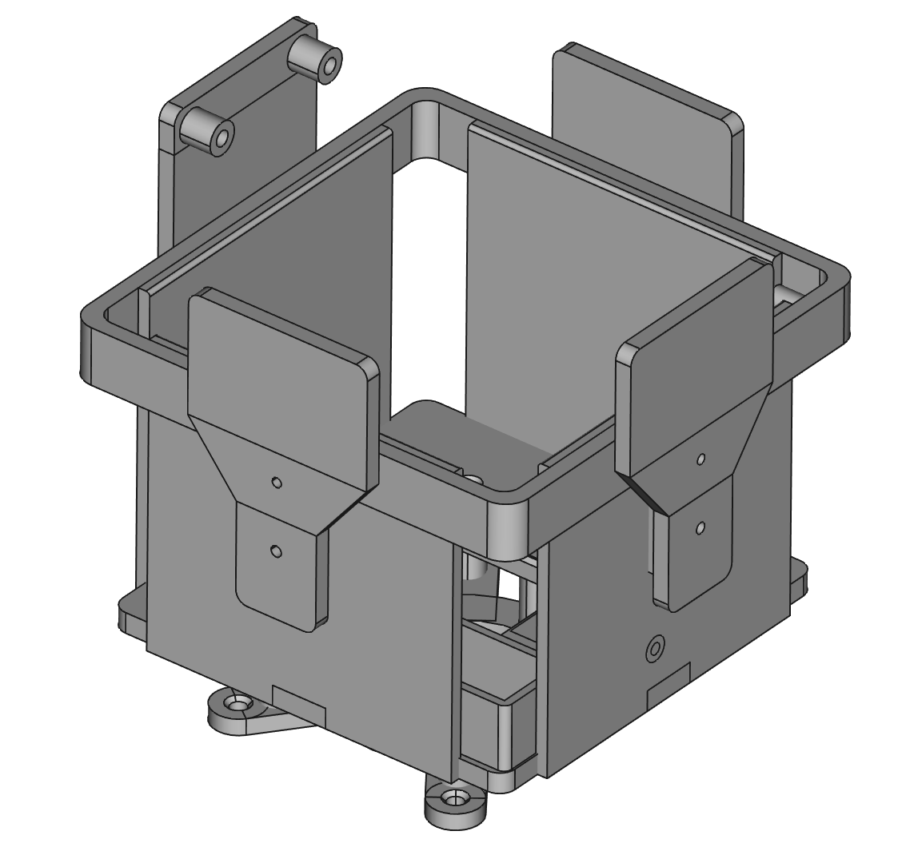
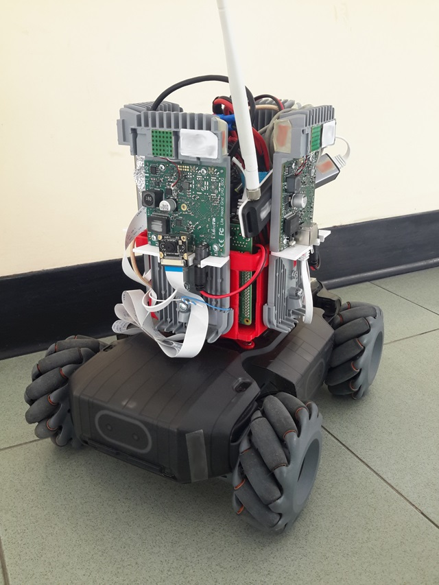
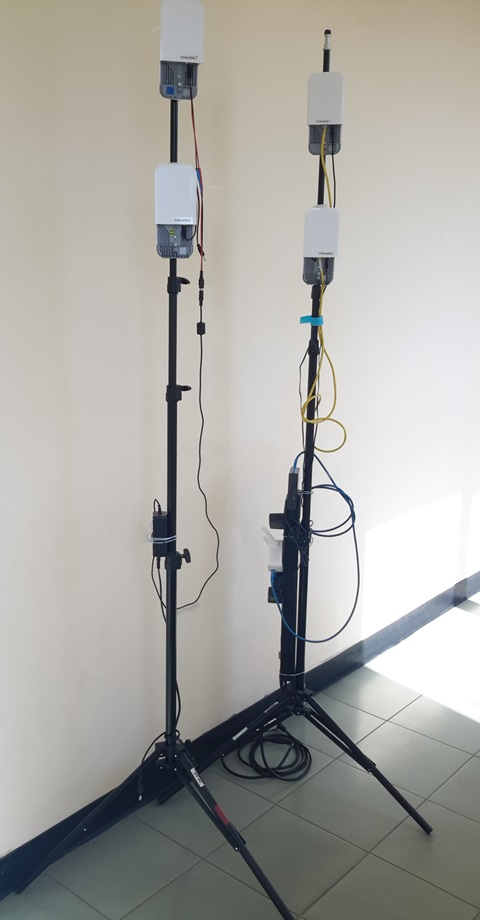

# LIQUID EDGE Microservices Inference

> These programs are a part of the system used for the LIQUID EDGE PRIN 2017 project demonstrator.

## CAD files
This folder contains the CAD files (in FREECad format) used to 3D-print the cradle box replacing the original turret of the Robomaster.

This is the look of the printed cradle box.

And this is what you get after physical installation on the robot. Note how you can mount the mmWave devices on the four sides, while the Raspberry and the S1 controller can be screwed in the threaded holes prepared inside the box. The remaining hardware can be scattered inside as well.

The access points can be mounted on video tripods used for holding set lights, as shown below.

